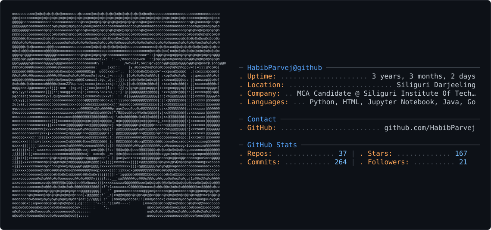

<picture>
  <source media="(prefers-color-scheme: dark)" srcset="dark_mode.svg" />
  <source media="(prefers-color-scheme: light)" srcset="light_mode.svg" />
  
</picture>

 

<h1 align="center">Hi, I'm Ahasan Habib Parvej 👋</h1>

  <b>Python Developer · Full Stack Engineer · Research Intern @ IIT Kharagpur</b> 
  Building practical software and intelligent systems that solve real-world problems.

  
  &nbsp;
  
  &nbsp;
  
  &nbsp;
  

---

## 👨‍💻 About Me

I'm an MCA graduate and Python/Django developer with hands-on experience across backend development, REST APIs, ML, and IoT — gained through internships at **IIT Kharagpur**, **Indian Army (SAINIK ERP)**, and **Dorii Software**.

I enjoy turning ideas into working systems: from ERP modules handling real data to IoT-based forestry intelligence at IIT Kharagpur.

- 🔭 Currently: Research Intern at **IIT Kharagpur** — building ForestNetra, an AI-powered forestry monitoring system using IoT + ML
- 🌐 Looking for: Full-time **Software Developer / Python / Full Stack** roles (India or Remote, ₹6 LPA+)
- 🎓 MCA from Siliguri Institute of Technology (MAKAUT) | CGPA: **8.66**

---

## 💼 Experience

### 🔬 Research Intern — IIT Kharagpur *(Aug 2026 – Present)*
- Working on **ForestNetra** — an AI-powered forestry monitoring and analysis system
- Developing IoT sensor nodes using **ESP32** with LoRa and RS485 communication
- Integrating environmental and plant sensors for real-time data collection
- Exploring **TinyML** and edge-based ML for on-device inference

### 🪖 Python Developer Intern — Indian Army *(Aug 2025 – Jan 2026)*
- Built backend modules for **SAINIK ERP**, a private internal management system
- Developed features using **Python and Django** across multiple application modules
- Worked with database models, role-based access control, and structured workflows

### 💼 Odoo Developer Intern — Dorii Software *(Jan 2026 – Mar 2026)*
- Developed and customised modules in **Odoo** for business process automation
- Worked with Python-based Odoo ORM, views, and workflow customisation

### 📊 Data Science Intern — Personifwy
- Performed EDA and data cleaning using **Pandas, NumPy, Matplotlib, Seaborn**
- Built and evaluated classification ML models

---

## 🚀 Featured Projects

| Project | Description | Stack |
|---|---|---|
| 🌲 **ForestNetra** *(Private)* | AI forestry monitoring system — IoT + ML at IIT Kharagpur | ESP32, LoRa, Python, TinyML |
| 🪖 **SAINIK ERP** *(Private)* | Backend modules for Indian Army internal management | Python, Django, PostgreSQL |
| 📩 **SMS Spam Classifier** | ML pipeline to detect spam messages with high accuracy | Python, Scikit-learn, NLP |
| 💳 **Credit Data Analysis** | EDA and visualisation of credit datasets | Pandas, Matplotlib, Seaborn |
| 🤖 **ChatBot** | Python-based conversational chatbot | Python, NLP |
| 🧠 **QuizGen** | Automated quiz generation system | Python, Django |
| 🌍 **WanderLog AI** | AI-based travel logging concept app | Python, Django |

> 📌 See pinned repositories below for source code and demos.

---

## 🛠️ Tech Stack

### Languages

### Backend & Frameworks

### DevOps & Infrastructure

### Databases

### ML & Data Science

### IoT & Embedded

---

## 🎓 Education

| Degree | Institution | CGPA | Year |
|---|---|---|---|
| **MCA** | Siliguri Institute of Technology (MAKAUT) | 8.66 | 2024 – 2026 |
| **BCA** | University of North Bengal | 8.63 | 2021 – 2024 |

---

## 📊 GitHub Stats

  
  &nbsp;
  

  

---

## 🌍 Open Source

**[JobPortal](https://github.com/Khushi-Nigam/jobportal)** — Contributed UI and backend improvements to a real-world open-source job portal. Worked with an existing codebase using collaborative Git workflows.

---

  <i>Open to full-time Software Developer / Python / Full Stack roles — India or Remote</i> 
  <a href="mailto:habibparvej777@gmail.com">habibparvej777@gmail.com</a> · <a href="https://www.linkedin.com/in/habibparvej">linkedin.com/in/habibparvej</a>

